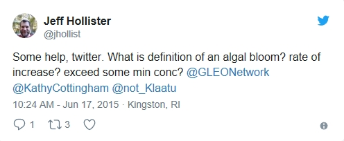
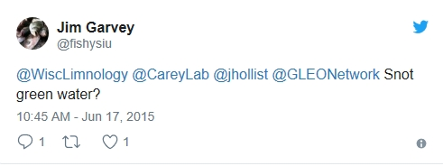
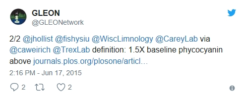
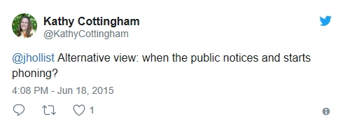

class: center, middle, inverse

# Problem: What is a bloom?

---

# Problem: What is a bloom?

## So of course, I asked Twitter

---

# Problem: What is a bloom?

## Got some of this variety

---

# Problem: What is a bloom?

## Got some of the more quantitative

---

# Problem: What is a bloom?

## and then the one closest to reality

---

# Problem: What is a bloom?

## Take away message

- No real concensus
- Should be relative to some baseline
  - Clarity?
  - Public concern?
  - Health risk?
- Still left with a decision

---

# Problem: What is a bloom?

## What could we use?

- Toxins?
  - Data few and far between
- Cell counts, bio-volume, etc.
  - Myriad problems
- Chlorophyll
  - Available, but is it associated with other cyano indicators

---
class: center, middle, inverse

# Possible Solution: Chlorophyll as a proxy for Microcystin

---

# Possible Solution: Chlorphyll as a proxy

## Chlorophyll relationships with mcyst

- Scatter
- Lester
- Possible, but
- still don't know what to call "a bloom"

---

# Possible Solution: Chlorphyll as a proxy

## Exsiting Microcystin Advisory Levels 

- WHO
- EPA

---
class: center, middle, inverse

# Our Solution: Chlorophyll and Microcystin

---

# Our Solution: Chlorophyll and Microsystin

## Conditional probability 

- What is it?
- What it tells us?

---

# Our Solution: Chlorophyll and Microsystin

## Data

---

# Our Solution: Chlorophyll and Microsystin

## Results

- cp plots

---

# Our Solution: Chlorophyll and Microsystin

## Results

- tables

---

# Our Solution: Chlorophyll and Microsystin

## Validation with 2012

- How did it work finding exceedances?

---
class: center, middle, inverse

# 

---

# Applications and caveats

## How to use

---

# Applications and caveats

## Important considerations

---
# Thanks!
.center[
## Jeff Hollister
US EPA  
Atlantic Ecology Division  
Narragansett, RI  

`r icon::fa("envelope", size = 1.5)`: [hollister.jeff@epa.gov](mailto:hollister.jeff@epa.gov)  
`r icon::fa("twitter", size = 1.5)`: [jhollist](https://twitter.com/jhollist)  
`r icon::fa("github", size = 1.5)`: [jhollist](https://github.com/jhollist)  

Slides created via the R package [**xaringan**](https://github.com/yihui/xaringan).
]

