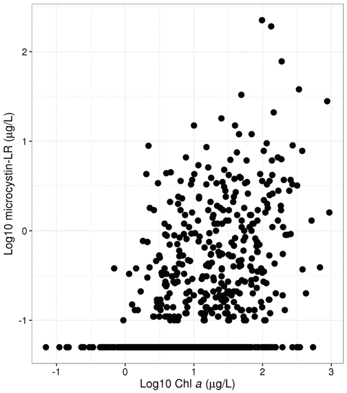

```{r echo=FALSE, message=FALSE}
library(tidyverse)
```

class: center, middle, inverse

# Problem: What is a bloom?

---

# Problem: What is a bloom?

## So of course, I asked Twitter


---

# Problem: What is a bloom?

## Got some of this variety


---

# Problem: What is a bloom?

## Got some of the more quantitative


---

# Problem: What is a bloom?

## And then the one closest to reality


---

# Problem: What is a bloom?

## Take away message

- No real concensus
- Should be relative to some baseline
  - Clarity?
  - Public concern?
  - Health risk?
- Still left with a decision

---

# Problem: What is a bloom?

## What could we use?

- Toxins?
  - Most direct measure
  - Data few and far between
- Cell counts, bio-volume, etc.
  - Myriad problems
- Chlorophyll
  - Available
  - Associated with cyanobacteria?

---
class: center, middle, inverse

# Possible Solution: Chlorophyll as a proxy for Microcystin

---

# Possible Solution: Chlorphyll as a proxy

.left-column[
- 2007 NLA show association
- Yuan *et al* (2014). Freshwater Biology 
- But, what is a bloom?
]

.right-column[

</img>

.image-credit[Hollister and Kreakie. (2016). https://f1000research.com/articles/5-151/v2]

]
---

# Possible Solution: Chlorphyll as a proxy

## Exsiting Microcystin Advisory Levels 

```{r microcystin_levels,echo=FALSE,results='asis', warning=FALSE}
source_of_stnd <- c("WHO",
                    "WHO",
                    "WHO",
                    "WHO",
                    "WHO",
                    "USEPA",
                    "USEPA")
type_of_stnd <- c("Recreational: Low Prob. of Effect",
                  "Recreational: Moderate Prob. of Effect",
                  "Recreational: High Prob. of Effect",
                  "Recreational: Very High Prob. of Effect",
                  "Drinking Water",
                  "Child Drinking Water Advisory",
                  "Adult Drinking Water Advisory")
concentration <- factor(c("2-4 µg/L",
                   "10-20 µg/L",
                   "20-2000 µg/L",
                   ">2000 µg/L",
                   "1 µg/L",
                   "0.3 µg/L",
                   "1.6 µg/L"), 
                   levels = c("0.3 µg/L",
                              "1 µg/L",
                              "1.6 µg/L",
                              "2-4 µg/L",
                              "10-20 µg/L",
                              "20-2000 µg/L",
                              ">2000 µg/L"))
#note <- c("Low probability of adverse health effects",
#          "Moderate probability of adverse health effects",
#          "High probability of adverse health effects, These higher #concentrations typically only seen in visible scums/algal mats",
#          "Very high probability of adverse health effects",
#          "",
#          "Children younger than school age",
#          "Individuals School age and older")
mc_conc_table <- data.frame(source_of_stnd, type_of_stnd, concentration) %>%
  arrange(concentration) %>% data.frame
names(mc_conc_table)<-c("Source","Type","  Concentration")
#pandoc.table(mc_conc_table,justify = "left" ,split.table = 120, split.cells  = c(20,20,20))
knitr::kable(mc_conc_table, format = "html")
```

---
class: center, middle, inverse

# Our Solution: Chlorophyll and Microcystin

---

# Our Solution: Chlorophyll and Microsystin

## Assocation chlorohpyll a  concentration with Microcystin guidance levels

- Conditional probability 
    - Probability of one event happening, given another has already happened
    - Our approach based entirely on data
    - History in environemntal applications
- Data
    - 2007 NLA
    - EPA and WHO guidance levels

---

# Our Solution: Chlorophyll and Microsystin

## Results

- cp plots

---

# Our Solution: Chlorophyll and Microsystin

## Results

- tables

---

# Our Solution: Chlorophyll and Microsystin

## Validation with 2012

- How did it work finding exceedances?

---
class: center, middle, inverse

# Applications and Caveats

---

# Applications and caveats

## How to use

---

# Applications and caveats

## Important considerations

---
# Thanks!
.center[
## Jeff Hollister
US EPA </br>
Atlantic Ecology Division </br>
Narragansett, RI </br>

`r icon::fa("envelope", size = 1.5)`: [hollister.jeff@epa.gov](mailto:hollister.jeff@epa.gov) </br>
`r icon::fa("twitter", size = 1.5)`: [jhollist](https://twitter.com/jhollist) </br>
`r icon::fa("github", size = 1.5)`: [jhollist](https://github.com/jhollist) </br>

Slides created via the R package [**xaringan**](https://github.com/yihui/xaringan).
]

