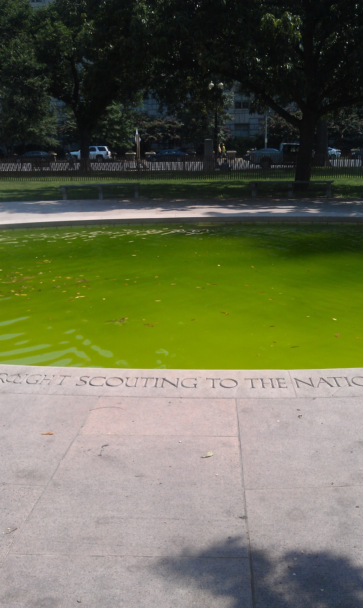
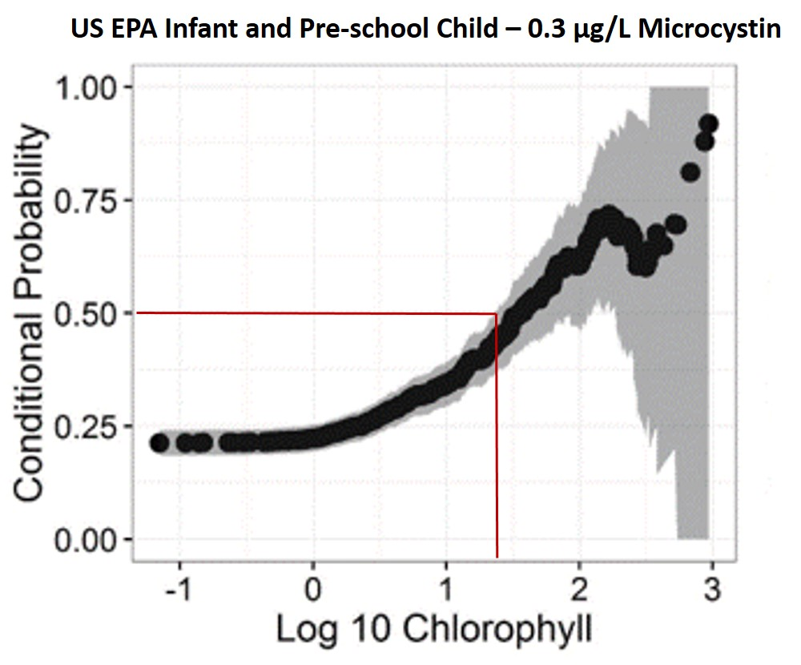

```{r setup, include=FALSE, echo=FALSE, warning=FALSE}
#Put whatever you normally put in a setup chunk.
#I usually at least include:
################################################################################
#Load packages
################################################################################
if(!require(microcystinchla)){
  devtools::install_github("usepa/microcystinchla",
                           auth_token = getOption("Github_Access"))
}
if(!require(viridis)){
  install.packages("viridis") 
}
library("microcystinchla")
library("dplyr")
library("magrittr")
library("pander")
library("knitr")
library("e1071")
library("tidyverse")
opts_chunk$set(dev = 'pdf', fig.width=6, fig.height=5)

# Table Captions from @DeanK on http://stackoverflow.com/questions/15258233/
# using-table-caption-on-r-markdown-file-using-knitr-to-use-in-pandoc-to-convert-t
# Figure captions are handled by LaTeX

knit_hooks$set(tab.cap = function(before, options, envir) {
                  if(!before) { 
                    paste('\n\n:', options$tab.cap, sep='') 
                  }
                })
default_output_hook = knit_hooks$get("output")
knit_hooks$set(output = function(x, options) {
  if (is.null(options$tab.cap) == FALSE) {
    x
  } else
    default_output_hook(x,options)
})
```

```{r analysis , include=FALSE, echo=FALSE, cache=TRUE}
#All analysis in here, that way all bits of the paper have access to the final objects
#Place tables and figures and numerical results where they need to go.


################################################################################
# Data Prep
################################################################################
nla_dat <- read.csv(system.file("extdata/nla_dat.csv", package = "microcystinchla"))

################################################################################
# Condtional Probability
################################################################################
mc_guides <- c(0.3, 1, 1.6, 2, 4, 10, 20)
mc_names <- c("USEPA","WHO","USEPA","WHO","WHO","WHO","WHO")
mc_type <- c("Child Drinking Water Advisory",
             "Drinking Water Advisory",
             "Adult Drinking Water",
             "Recreational: Low Prob. of Effect",
             "Recreational: Moderate Prob. of Effect",
             "Recreational: High Prob. of Effect",
             "Recreational: Very High Prob. of Effect")
mc_chla <- vector("numeric",length(mc_guides))
#wgt <- nla_dat$WGT_NLA
wgt<- rep(1,nrow(nla_dat))

set.seed(19720923)
################################################################################
# Condtional Probability
################################################################################
mc_guides <- c(0.3, 1, 1.6, 2, 4, 10, 20)
mc_names <- c("USEPA","WHO","USEPA","WHO","WHO","WHO","WHO")
mc_type <- c("Child Drinking Water Advisory",
             "Drinking Water Advisory",
             "Adult Drinking Water",
             "Recreational: Low Prob. of Effect",
             "Recreational: Moderate Prob. of Effect",
             "Recreational: High Prob. of Effect",
             "Recreational: Very High Prob. of Effect")

#wgt <- nla_dat$WGT_NLA
wgt<- rep(1,nrow(nla_dat))

set.seed(19720923)
epa_child_cp <- condprob(xX = nla_dat$log_chla,xY = nla_dat$log_micro, 
                     xImpair = log10(mc_guides[1]), ProbComp = "gt", Exceed = "gte",
                     ci = TRUE, R = 10000, xW=wgt)

mc_chla[1] <- get_chla(epa_child_cp,0.5)
set.seed(19720923)
who_drink_cp <- condprob(xX = nla_dat$log_chla,xY = nla_dat$log_micro, 
                     xImpair = log10(mc_guides[2]), ProbComp = "gt", Exceed = "gte",
                     ci = TRUE, R = 10000, xW=wgt)

mc_chla[2] <- get_chla(who_drink_cp,0.5)
set.seed(19720923)
epa_adult_cp <- condprob(xX = nla_dat$log_chla,xY = nla_dat$log_micro, 
                     xImpair = log10(mc_guides[3]), ProbComp = "gt", Exceed = "gte",
                     ci = TRUE, R = 10000, xW=wgt)

mc_chla[3] <- get_chla(epa_adult_cp,0.5)
set.seed(19720923)
who_rec_low1_cp <- condprob(xX = nla_dat$log_chla,xY = nla_dat$log_micro, 
                     xImpair = log10(mc_guides[4]), ProbComp = "gt", Exceed = "gte",
                     ci = TRUE, R = 10000, xW=wgt)

mc_chla[4] <- get_chla(who_rec_low1_cp,0.5)
epa_child <- NULL
who_drink <- NULL
epa_adult <- NULL
who_rec <- NULL
cps<- seq(0.1,0.9,0.1)
for(i in 1:9){
  epa_child[i] <- get_chla(epa_child_cp,cps[i])[1]
  if(epa_child[i]>0.1){epa_child[i]<-round(epa_child[i])}
  who_drink[i] <- get_chla(who_drink_cp,cps[i])[1]
  if(who_drink[i]>0.1){who_drink[i]<-round(who_drink[i])}
  epa_adult[i] <- get_chla(epa_adult_cp,cps[i])[1]
  if(epa_adult[i]>0.1){epa_adult[i]<-round(epa_adult[i])}
  who_rec[i] <- get_chla(who_rec_low1_cp,cps[i])[1]
  if(who_rec[i]>0.1){who_rec[i]<-round(who_rec[i])}
}

mc_chla<-cbind(epa_child,who_drink,
               epa_adult,who_rec)

#Agreement Tables
child_conmat<-conmat_to_df(table(chla=nla_dat$CHLA>=mc_chla[5,1],
                                 mcsyt=nla_dat$MCYST_TL_UGL>=0.3))
child_conmat$tots<-child_conmat[,1]+child_conmat[,2]
child_conmat[3,]<-child_conmat[1,]+child_conmat[2,]

who_drink_conmat<-conmat_to_df(table(nla_dat$CHLA>=mc_chla[5,2],
                        nla_dat$MCYST_TL_UGL>=1))
who_drink_conmat$tots<-who_drink_conmat[,1]+who_drink_conmat[,2]
who_drink_conmat[3,]<-who_drink_conmat[1,]+who_drink_conmat[2,]

adult_conmat<-conmat_to_df(table(nla_dat$CHLA>=mc_chla[5,3],
                    nla_dat$MCYST_TL_UGL>=1.6))
adult_conmat$tots<-adult_conmat[,1]+adult_conmat[,2]
adult_conmat[3,]<-adult_conmat[1,]+adult_conmat[2,]

who_rec_conmat<-conmat_to_df(table(nla_dat$CHLA>=mc_chla[5,4],
                      nla_dat$MCYST_TL_UGL>=2))
who_rec_conmat$tots<-who_rec_conmat[,1]+who_rec_conmat[,2]
who_rec_conmat[3,]<-who_rec_conmat[1,]+who_rec_conmat[2,]


names(child_conmat)<-c("Not Exceed","Exceed","Row Totals")
row.names(child_conmat)<-c("Not Exceed","Exceed","Column Totals")
names(who_drink_conmat)<-c("Not Exceed","Exceed","Row Totals")
row.names(who_drink_conmat)<-c("Not Exceed","Exceed","Column Totals")
names(adult_conmat)<-c("Not Exceed","Exceed","Row Totals")
row.names(adult_conmat)<-c("Not Exceed","Exceed","Column Totals")
names(who_rec_conmat)<-c("Not Exceed","Exceed","Row Totals")
row.names(who_rec_conmat)<-c("Not Exceed","Exceed","Column Totals")


total_accuracy<-NULL
total_accuracy$epa_child<-round((child_conmat[1,1]+child_conmat[2,2])/
  sum(child_conmat[1:2,1:2]),2)
total_accuracy$who_drink<-round((who_drink_conmat[1,1]+who_drink_conmat[2,2])/
  sum(who_drink_conmat[1:2,1:2]),2)
total_accuracy$epa_adult<-round((adult_conmat[1,1]+adult_conmat[2,2])/
  sum(adult_conmat[1:2,1:2]),2)
total_accuracy$who_rec<-round((who_rec_conmat[1,1]+who_rec_conmat[2,2])/
  sum(who_rec_conmat[1:2,1:2]),2)

fn_percent<-NULL
fn_percent$epa_child<-round((child_conmat[1,2])/
  sum(child_conmat[1:2,1:2]),2)
fn_percent$who_drink<-round((who_drink_conmat[1,2])/
  sum(who_drink_conmat[1:2,1:2]),2)
fn_percent$epa_adult<-round((adult_conmat[1,2])/
  sum(adult_conmat[1:2,1:2]),2)
fn_percent$who_rec<-round((who_rec_conmat[1,2])/
  sum(who_rec_conmat[1:2,1:2]),2)
```


class: center, middle, inverse

# Problem: What is a bloom?

---

# Problem: What is a bloom?

## So of course, I asked Twitter


---

# Problem: What is a bloom?

## Got some of this variety


---

# Problem: What is a bloom?

## Got some of the more quantitative


---

# Problem: What is a bloom?

## And then the one closest to reality


---

# Problem: What is a bloom?

## Take away message

.left-column[
- No real concensus
- Should be relative to some baseline
  - Clarity?
  - Public concern?
  - Health risk?
- Still left with a decision on how to quantify
]

.right-column[

</img>
]
---

# Problem: What is a bloom?

## What could we use?

.left-column[
- Cell counts, bio-volume, etc.
  - Myriad problems
- Toxins
  - Most direct measure
  - Data few and far between
- Chlorophyll
  - Available
  - Associated with cyanobacteria?
] 

.right-column[

</img>

]
---
class: center, middle, inverse

# Possible Solution: Chlorophyll as a proxy for Microcystin

---

# Possible Solution: Chlorphyll as a proxy

.left-column[
- 2007 NLA show association
- Yuan *et al* (2014). Freshwater Biology 
- But, what is a bloom?
]

.right-column[

</img>

.image-credit[Hollister and Kreakie. (2016). https://f1000research.com/articles/5-151/v2]

]
---

# Possible Solution: Chlorphyll as a proxy

## Exsiting Microcystin Advisory Levels 

```{r microcystin_levels,echo=FALSE,results='asis', warning=FALSE}
source_of_stnd <- c("WHO",
                    "WHO",
                    "WHO",
                    "WHO",
                    "WHO",
                    "USEPA",
                    "USEPA")
type_of_stnd <- c("Recreational: Low Prob. of Effect",
                  "Recreational: Moderate Prob. of Effect",
                  "Recreational: High Prob. of Effect",
                  "Recreational: Very High Prob. of Effect",
                  "Drinking Water",
                  "Infant and Pre-school Child Drinking Water Advisory",
                  "School Age Child and Adult Drinking Water Advisory")
concentration <- c("2-4 µg/L",
                   "10-20 µg/L",
                   "20-2000 µg/L",
                   ">2000 µg/L",
                   "1 µg/L",
                   "0.3 µg/L",
                   "1.6 µg/L")
order <- c(4,5,6,7,2,1,3)
#note <- c("Low probability of adverse health effects",
#          "Moderate probability of adverse health effects",
#          "High probability of adverse health effects, These higher #concentrations typically only seen in visible scums/algal mats",
#          "Very high probability of adverse health effects",
#          "",
#          "Children younger than school age",
#          "Individuals School age and older")
mc_conc_table <- data.frame(source_of_stnd, type_of_stnd, concentration,order) %>%
  arrange(order) %>%
  select(source_of_stnd,type_of_stnd,concentration)
names(mc_conc_table)<-c("Source","Type","Concentration")
#pandoc.table(mc_conc_table,justify = "left" ,split.table = 120, split.cells  = c(20,20,20))
knitr::kable(mc_conc_table, format="html")
```

---
class: center, middle, inverse

# Our Solution: Chlorophyll and Microcystin

---

# Our Solution: Chlorophyll and Microsystin

## Assocating chlorohpyll *a*  concentration with Microcystin guidance levels

- Hollister and Kreakie (2016) Associations between chlorophyll a and various microcystin health advisory concentrations. <https://f1000research.com/articles/5-151/v2>
- Conditional probability 
    - Probability of one event happening, given another has already happened
    - Our approach based entirely on data
    - History in environemntal applications
- Data
    - 2007 NLA
    - EPA and WHO guidance levels

---

# Results: Chlorophyll *a*  and Microsystin

.center[
</img>
]

---

# Results: Chlorophyll *a*  and Microsystin

## Results

```{r mc_chla_table, results='asis', echo=FALSE}
mc_chla_tbl <- data.frame(seq(0.1,0.9,0.1),round(mc_chla, 0))
names(mc_chla_tbl)<-c("Cond. Probability","USEPA Child (0.3 µg/L)", "WHO Drink (1 µg/L)", "USEPA Adult (1.6 µg/L)", "WHO Recreational (2 µg/L) ")
#pandoc.table(mc_chla_tbl,justify = "left" ,split.table = 120, split.cells  = c(20,20,20))
knitr::kable(mc_chla_tbl, format = "html")#,format="latex")
```

---

# Our Solution: Chlorophyll *a*  and Microsystin

## Validation with 2012 National Lakes Assessment

```{r, echo=FALSE, message=FALSE, warning=FALSE}
nla12_tox <- read_csv("https://www.epa.gov/sites/production/files/2016-11/nla2012_algaltoxins_08192016.csv") %>%
  select(UID, MICL_RESULT)
nla12_chla <- read_csv("https://www.epa.gov/sites/production/files/2016-11/nla2012_chla_wide.csv") %>%
  select(UID, CHLL_RESULT)
nla12 <- full_join(nla12_chla, nla12_tox) %>%
  na.omit() %>%
  mutate(child_cp_exceed = CHLL_RESULT >= 23,
         child_cp_exceed_40 = CHLL_RESULT >= 11,
         actual_child_exceed = MICL_RESULT >= 0.3, 
         adult_cp_exceed = CHLL_RESULT >= 84,
         actual_adult_exceed = MICL_RESULT >= 1.6)
ta_perc_child_50 <- 100*sum(nla12$child_cp_exceed==nla12$actual_child_exceed)/nrow(nla12)
fn_perc_child_50 <- 100*sum(nla12$child_cp_exceed == 0 & nla12$actual_child_exceed == 1)/nrow(nla12)
ta_perc_adult <- 100*sum(nla12$adult_cp_exceed==nla12$actual_adult_exceed)/nrow(nla12)
fn_perc_adult <- 100*sum(nla12$adult_cp_exceed == 0 & nla12$actual_adult_exceed == 1)/nrow(nla12)
ta_perc_child_40 <- 100*sum(nla12$child_cp_exceed_40==nla12$actual_child_exceed)/nrow(nla12)
fn_perc_child_40 <- 100*sum(nla12$child_cp_exceed_40 == 0 & nla12$actual_child_exceed == 1)/nrow(nla12)
```

- EPA Infant and pre-school children - 50% Cond. Prob. (23 µg/L Chl *a* - 0.3 µg/L Microcystin)
    - Total Accuracy: `r round(ta_perc_child_50, 0)`%
    - False Negative: `r round(fn_perc_child_50, 0)`%
- EPA Infant and pre-school children - 40% Cond. Prob. (11 µg/L Chl *a* - 0.3 µg/L Microcystin)
    - Total Accuracy: `r round(ta_perc_child_40, 0)`%
    - False Negative: `r round(fn_perc_child_40, 0)`%

.left-column-even[

#### Infant and Pre-school - 50% Cond. Prob.

```{r echo=FALSE} 
df <- conmat_to_df(table(nla12$child_cp_exceed, nla12$actual_child_exceed)) #%>%
  #mutate(" " = row.names(.), "  " = "Chl a > 23") %>%
  #select("  ", " ", "FALSE", "TRUE") 

knitr::kable(df, format = "html") #%>%
  #kableExtra::collapse_rows(columns = 1) %>%
  #kableExtra::add_header_above(c(" ", " ","Microcystin > 0.3 µg/L" = 2))
```

]

.right-column-even[

#### Infant and Pre-school - 40% Cond. Prob.

```{r echo=FALSE} 
df <- conmat_to_df(table(nla12$child_cp_exceed_40, nla12$actual_child_exceed)) #%>%
  #mutate(" " = row.names(.), "  " = "Chl a > 84") %>%
  #select("  ", " ", "FALSE", "TRUE") 

knitr::kable(df, format = "html") #%>%
  #kableExtra::collapse_rows(columns = 1) %>%
  #kableExtra::add_header_above(c(" ", " ","Microcystin > 1.6 µg/L" = 2))

```
]    

---
class: center, middle, inverse

# Applications and Caveats

---

# Applications and caveats

- Identify potential past bloom events
- Screening tool
  - Helps with limited resources
    - Test for microcystin only when more likely to find it
  - Caveat: Current numbers based on National data
  - Caveat: Analyzing for toxins, if possible, still better
- Chlorophyll *a* cutoff to use is management decision

.center[

</img>
]
---


# Thanks!
.left-column-even[
## Jeff Hollister
US EPA </br>
Atlantic Ecology Division </br>
Narragansett, RI </br>

`r icon::fa("envelope", size = 1.5)`: [hollister.jeff@epa.gov](mailto:hollister.jeff@epa.gov) </br>
`r icon::fa("twitter", size = 1.5)`: [jhollist](https://twitter.com/jhollist) </br>
`r icon::fa("github", size = 1.5)`: [jhollist](https://github.com/jhollist) </br>
]

.right-column-even[
## Betty Kreakie
US EPA </br>
Atlantic Ecology Division </br>
Narragansett, RI </br>

`r icon::fa("envelope", size = 1.5)`: [kreakie.betty@epa.gov](mailto:kreakie.betty@epa.gov) </br>
`r icon::fa("github", size = 1.5)`: [BKreakie](https://github.com/BKreakie) </br>
]


